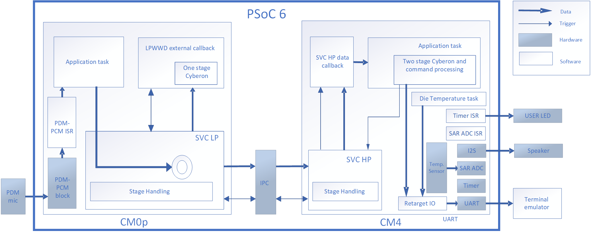

# PSoC&trade; 6: Dual-CPU audio wake word and command detection using Cyberon
This code example demonstrates how to use the dual-CPU architecture of the PSoC&trade; 6 MCU to implement an audio wake word detection and command processing. It makes use of Infineon Staged Voice Control (SVC) middleware, the "DSpotter" library from Cyberon, and FreeRTOS.

[View this README on GitHub.](https://github.com/Infineon/mtb-example-psoc6-dual-cpu-cyberon-freertos)

[Provide feedback on this code example.](https://cypress.co1.qualtrics.com/jfe/form/SV_1NTns53sK2yiljn?Q_EED=eyJVbmlxdWUgRG9jIElkIjoiQ0UyMzY5MTciLCJTcGVjIE51bWJlciI6IjAwMi0zNjkxNyIsIkRvYyBUaXRsZSI6IlBTb0MmdHJhZGU7IDY6IER1YWwtQ1BVIGF1ZGlvIHdha2Ugd29yZCBhbmQgY29tbWFuZCBkZXRlY3Rpb24gdXNpbmcgQ3liZXJvbiIsInJpZCI6InBhdGlscmFodWxhbiIsIkRvYyB2ZXJzaW9uIjoiMS4wLjAiLCJEb2MgTGFuZ3VhZ2UiOiJFbmdsaXNoIiwiRG9jIERpdmlzaW9uIjoiTUNEIiwiRG9jIEJVIjoiSUNXIiwiRG9jIEZhbWlseSI6IlBTT0MifQ==)

## Requirements

- [ModusToolbox&trade;](https://www.infineon.com/modustoolbox) v3.1 or later (tested with v3.1)
- Board support package (BSP) minimum required version: 4.0.0
- Programming language: C
- Associated parts: All [PSoC&trade; 6 MCU](https://www.infineon.com/cms/en/product/microcontroller/32-bit-psoc-arm-cortex-microcontroller/psoc-6-32-bit-arm-cortex-m4-mcu) parts

## Supported toolchains (make variable 'TOOLCHAIN')

- GNU Arm&reg; Embedded Compiler v11.3.1 (`GCC_ARM`) - Default value of `TOOLCHAIN`

## Supported kits (make variable 'TARGET')

- [PSoC&trade; 62S2 Evaluation Kit](https://www.infineon.com/CY8CEVAL-062S2) (`CY8CEVAL-062S2`) – Default target

## Hardware setup

Connect the CY8CKIT-028-SENSE shield to the Arduino header.
This example uses the board's default configuration. See the kit user guide to ensure that the board is configured correctly.

## Software setup

Install a terminal emulator if you don't have one. Instructions in this document use [Tera Term](https://ttssh2.osdn.jp/index.html.en).
This example requires no additional software or tools.

## Obtaining the license file

Go to [Cyberon DSpotter License for Infineon Platform](https://license.cyberon.tw/InfineonDSpotterLicense/InfineonDSpotterLicense.php) to obtain a license file for the Cyberon keyword detection engine. The chipset ID can be accessed by executing the code example.

## Using the code example

### Create the project

The ModusToolbox&trade; tools package provides the Project Creator as both a GUI tool and a command line tool.

<details><summary><b>Use Project Creator GUI</b></summary>

1. Open the Project Creator GUI tool.

   There are several ways to do this, including launching it from the dashboard or from inside the Eclipse IDE for ModusToolbox&trade;. For more details, see the [Project Creator user guide](https://www.infineon.com/ModusToolboxProjectCreator) (locally available at *{ModusToolbox&trade; install directory}/tools_{version}/project-creator/docs/project-creator.pdf*).

2. On the **Choose Board Support Package (BSP)** page, select a kit supported by this code example. See [Supported kits](#supported-kits-make-variable-target).

   > **Note:** To use this code example for a kit not listed here, you may need to update the source files. If the kit does not have the required resources, the application may not work.

3. On the **Select Application** page:

   a. Select the **Applications(s) Root Path** and the **Target IDE**.

   > **Note:** Depending on how you open the Project Creator tool, these fields may be pre-selected for you.

   b.	Select this code example from the list by enabling its check box.

   > **Note:** You can narrow the list of displayed examples by typing in the filter box.

   c. (Optional) Change the suggested **New Application Name** and **New BSP Name**.

   d. Click **Create** to complete the application creation process.

</details>

<details><summary><b>Use Project Creator CLI</b></summary>

The 'project-creator-cli' tool can be used to create applications from a CLI terminal or from within batch files or shell scripts. This tool is available in the *{ModusToolbox&trade; install directory}/tools_{version}/project-creator/* directory.

Use a CLI terminal to invoke the 'project-creator-cli' tool. On Windows, use the command line 'modus-shell' program provided in the ModusToolbox&trade; installation instead of a standard Windows command-line application. This shell provides access to all ModusToolbox&trade; tools. You can access it by typing "modus-shell" in the search box in the Windows menu. In Linux and macOS, you can use any terminal application.

The following example clones the "[Dual-CPU Cyberon Freertos](https://github.com/Infineon/mtb-example-psoc6-dual-cpu-cyberon-freertos)" application with the desired name "DualCPUCyberonFreeRTOS" configured for the *CY8CEVAL-062S2* BSP into the specified working directory, *C:/mtb_projects*:

   ```
   project-creator-cli --board-id CY8CEVAL-062S2 --app-id mtb-example-psoc6-dual-cpu-cyberon-freertos --user-app-name DualCPUCyberonFreeRTOS --target-dir "C:/mtb_projects"
   ```

<mark>Update the above paragraph and commands to match your CE.

The 'project-creator-cli' tool has the following arguments:

Argument | Description | Required/optional
---------|-------------|-----------
`--board-id` | Defined in the <id> field of the [BSP](https://github.com/Infineon?q=bsp-manifest&type=&language=&sort=) manifest | Required
`--app-id`   | Defined in the <id> field of the [CE](https://github.com/Infineon?q=ce-manifest&type=&language=&sort=) manifest | Required
`--target-dir`| Specify the directory in which the application is to be created if you prefer not to use the default current working directory | Optional
`--user-app-name`| Specify the name of the application if you prefer to have a name other than the example's default name | Optional

> **Note:** The project-creator-cli tool uses the `git clone` and `make getlibs` commands to fetch the repository and import the required libraries. For details, see the "Project creator tools" section of the [ModusToolbox&trade; tools package user guide](https://www.infineon.com/ModusToolboxUserGuide) (locally available at {ModusToolbox&trade; install directory}/docs_{version}/mtb_user_guide.pdf).

</details>


### Open the project

After the project has been created, you can open it in your preferred development environment.


<details><summary><b>Eclipse</b></summary>

If you opened the Project Creator tool from the included Eclipse IDE, the project will open in Eclipse automatically.

For more details, see the [Eclipse IDE for ModusToolbox&trade; user guide](https://www.infineon.com/MTBEclipseIDEUserGuide) (locally available at *{ModusToolbox&trade; install directory}/docs_{version}/mt_ide_user_guide.pdf*).

</details>


<details><summary><b>Visual Studio (VS) Code</b></summary>

Launch VS Code manually, and then open the generated *{project-name}.code-workspace* file located in the project directory.

For more details, see the [Visual Studio Code for ModusToolbox&trade; user guide](https://www.infineon.com/MTBVSCodeUserGuide) (locally available at *{ModusToolbox&trade; install directory}/docs_{version}/mt_vscode_user_guide.pdf*).

</details>


<details><summary><b>Keil µVision</b></summary>

Double-click the generated *{project-name}.cprj* file to launch the Keil µVision IDE.

For more details, see the [Keil µVision for ModusToolbox&trade; user guide](https://www.infineon.com/MTBuVisionUserGuide) (locally available at *{ModusToolbox&trade; install directory}/docs_{version}/mt_uvision_user_guide.pdf*).

</details>


<details><summary><b>IAR Embedded Workbench</b></summary>

Open IAR Embedded Workbench manually, and create a new project. Then select the generated *{project-name}.ipcf* file located in the project directory.

For more details, see the [IAR Embedded Workbench for ModusToolbox&trade; user guide](https://www.infineon.com/MTBIARUserGuide) (locally available at *{ModusToolbox&trade; install directory}/docs_{version}/mt_iar_user_guide.pdf*).

</details>


<details><summary><b>Command line</b></summary>

If you prefer to use the CLI, open the appropriate terminal, and navigate to the project directory. On Windows, use the command line 'modus-shell' program; on Linux and macOS, you can use any terminal application. From there, you can run various `make` commands.

For more details, see the [ModusToolbox&trade; tools package user guide](https://www.infineon.com/ModusToolboxUserGuide) (locally available at *{ModusToolbox&trade; install directory}/docs_{version}/mtb_user_guide.pdf*).

</details>


## Operation

1. Connect the board to your PC using the provided USB cable through the KitProg3 USB connector.

2. Replace the *CybLicense.bin* file in the *cm0_app\source\one_stage_cyberon*  and *cm4_app\source\two_stage_cyberon* directories with your license file using the same file name.

3. Open a terminal program and select the KitProg3 COM port. Set the serial port parameters to 8N1 and 115200 baud.

4. Program the board using one of the following:

   <details><summary><b>Using Eclipse IDE</b></summary>

      1. Select the application project in the Project Explorer.

      2. In the **Quick Panel**, scroll down, and click **\<Application Name> Program (KitProg3_MiniProg4)**.
   </details>

   <details><summary><b>Using CLI</b></summary>

     From the terminal, execute the `make program` command to build and program the application using the default toolchain to the default target. The default toolchain is specified in the application's Makefile but you can override this value manually:
      ```
      make program TOOLCHAIN=<toolchain>
      ```

      Example:
      ```
      make program TOOLCHAIN=GCC_ARM
      ```
   </details>
5. After programming, the application starts automatically.
6. Say the wake word "Ok Infineon" followed by any of the command, such as "Blink light quickly". User LED will start blinking at 10 Hz.


## Create and import the custom model

1. Log into DSpotter Modeling Tool (DSMT) with the trial account. Use the following credentials:

   - Account: `infineon_trial@cyberon.com.tw`
   - Keep the password field blank and click **Login**.

   **Note:** The DSMT account works only on a Windows PC.

2. Create one-stage (for CM0p) and two-stage (for CM4) DSMT projects with the wake word (Group 1) and commands (Group 2). Make sure that the wake word is the same in both projects. Save the project.

3. Note that the model BIN files created in the project. Replace the already available model BIN files with the customized models in both CM0p and CM4 projects.

4. Update the file name in the *one_stage_cyberon\cyberon_data.s* and *two_stage_cyberon\cyberon_data.s* file with the newly added model bin files name.

To learn about DSMT, see the following resources:

- [Cyberon DSMT Tool v2 Help](https://tool.cyberon.com.tw/DSMT_V2/index.php?lang=en)

- [DSMT tutorial slides](https://drive.google.com/file/d/1kWrJ7OXgHTF4YPft6WRHeVlXVCGiqTNx/view)

- [DSMT tutorial video](https://www.youtube.com/playlist?list=PLTEknqO5GAbrDX5NMs-P6b9THWwamgVBo)

## Debugging


You can debug the example to step through the code.


<details><summary><b>In Eclipse IDE for ModusToolbox&trade;</b></summary>

Use the **\<Application Name> Debug (KitProg3_MiniProg4)** configuration in the **Quick Panel**. For details, see the "Program and debug" section in the [Eclipse IDE for ModusToolbox&trade; user guide](https://www.infineon.com/MTBEclipseIDEUserGuide).


> **Note:** **(Only while debugging)** On the CM4 CPU, some code in `main()` may execute before the debugger halts at the beginning of `main()`. This means that some code executes twice – once before the debugger stops execution, and again after the debugger resets the program counter to the beginning of `main()`. See [KBA231071](https://community.infineon.com/docs/DOC-21143) to learn about this and for the workaround.

</details>


<details><summary><b>In other IDEs</b></summary>

Follow the instructions in your preferred IDE.
</details>


## Design and implementation

Typically, audio keywords are grouped into two types:

- Wake word/always listening commands, such as "Ok Infineon".

- Intents/Automatic Speech Recognition (ASR) commands, such as "What is the temperature?" and  "Blink light".

Such grouping of audio keywords enables effective use of the dual-CPU architecture. In this dual-CPU code example, the CM0p CPU is always active and waiting for a wake word, while the CM4 CPU is dormant. When a wake word is detected, the CM0p core awakens the CM4 core to begin reverifying the wake word and processing commands. It makes sense to use CM4 for command processing because detecting commands and carrying out the specified action for a command demands heavy computation.

During the command processing stage, CM0p will only be buffering data and passing the audio buffer pointer to CM4. The Staged Voice Control (SVC) middleware handles the switching between stages and communication between the two cores.

**Figure 1. Block diagram**



A PDM microphone is available on the supported kits either through the Sense shield or directly on the kit. A single-bit PDM signal is provided by the digital microphone. This digital signal is transformed into a quantized 16-bit value (PCM) by the PDM-PCM block of the PSoC&trade; 6 MCU. The PDM-PCM block interrupt is configured to trigger every 10 msec (160 samples/audio frame/frame). The data is transferred through the FreeRTOS queue from the PDM-PCM ISR to the ping-pong buffers of the application task.

In the application task, the audio frame is fed into the SVC middleware of CM0p. The CM0p SVC middleware copies the data into a circular buffer. A callback is invoked and the frame is consumed by the one-stage Cyberon library to check the wake word. When the wake word is detected, the CM0p SVC middleware sends the trigger to CM4 followed by the circular buffer pointer and pre-roll frame count. This wakes up CM4 if it is in sleep. Now onwards, CM0p will be just buffering the data into the circular buffer.

The CM4 SVC middleware invokes a data callback notifying the circular buffer data pointer and number of frames available for reverification of the wake word. The communication between the callback and application task for the data pointer and frame count is carried out over the FreeRTOS queue. The CM4 application task copies the frames from the circular buffer into a local buffer. The two-stage Cyberon library consumes the frames from the local buffer and reverifies the wake word.

If a wake word is detected, the state of the CM4 SVC middleware is updated to the detected CM4 wake word and a trigger is sent to the CM0p SVC middleware to get the frames for command detection. The two-stage Cyberon library will consume the frames to check the command. On successful detection of the command, CM4 will do the desired action for that command. The CM4 SVC middleware switches from "ASR detected", "ASR processing" and "ASR processing completed" in the command processing stage. On completion of ASR processing, CM4 goes to sleep if it has no other task to work upon and CM0p switches back to wake word detection mode. The code example prints the wake word and command detection info on the terminal.

If the wake word detection fails at the CM4 level, the state of the CM4 SVC middleware is updated to "HPWWND" (high performance wake word not detected). In this case, CM4 goes to sleep if it has no other task to work upon and CM0p switches back to wake word detection mode.

Two DSMT projects are created one for each core as follows:

1. One-stage DSMT project for CM0p: Contains only one group i.e., wake word group

2. Two-stage DSMT project on CM4: Contains the wake word group and commands/intents groups

In two-stage, the wake word group acts as a gatekeeper for second-stage group. In this code example, only one group is present in commands/intents group. Thus, all the commands in the command group are available only after a wake word is detected. If command is not detected within seven seconds (configurable), the wake word group is reactivated automatically on CM0p. This demo version has a limit of 50 times recognitions.

**Table 1. Wake word and commands**

| Types                 | Wake word          | Command                 | Command ID|actions|
|----------             |--------------------|-------------------------|------|-----------|
| One-stage (for CM0p)  | "Ok Infineon"        |                         |101   |The wake word is printed on terminal.|
| Two-stage (for CM4)   | "Ok Infineon"        |                         |101   |The wake word ID is printed on the terminal and the User LED is turned ON.|
|                       |                    | "What is the temperature" |201   |The die temperature is printed on the terminal.|
|                       |                    | "Blink light quickly"     |202   |The user LED blinks at 10 Hz.|
|                       |                    | "Blink light slowly"      |203   |The user LED blinks at 2 Hz.|
|                       |                    | "Stop light blinking"    |204   |The user LED stops blinking.|

### Firmware details

**Table 2. Project files**

Directory  | Description
------|-------
*cm0p_app* | Contains the CM0p project
*svc_lp* | Contains the CM0p SVC middleware configurations, init function, and CM0p wake word callback
*cyberon\cyberon_sample_code* |Contains the one or two stage Cyberon sample code
*cyberon\custom_one_stage* |Contains the custom one-stage cyberon asr process function code
*cyberon\custom_two_stage* |Contains the custom two-stage cyberon asr process function code
*cm4_app* | Contains the CM4 project
*svc_hp* |Contains the CM4 SVC middleware configurations, init function, and CM4 SVC data callback
*two_stage_cyberon* | Contains the one-stage Cyberon license, model, and ASR functions
*custom_pm* |Contains the custom settings for power management in system deep sleep mode

### Resources and settings

**Table 3. Application resources**

 Resource  |  Alias/object     |    Purpose
 :------- | :------------    | :------------
 PDM/PCM (PDL)|CYBSP_PDM_PCM_HW| To interface with digital microphones |
 SAR ADC (PDL) | SAR | To periodically blink user LED |
 UART (HAL)|cy_retarget_io_uart_obj| UART HAL object used by Retarget-IO for Debug UART port |
 Timer (HAL) | led_blink_timer | Timer HAL object to periodically trigger LED blinking |
 GPIO (HAL) | CYBSP_USER_LED | To indicate the command detection and to do a action corresponding to a command |


<br>

## Related resources

Resources  | Links
-----------|----------------------------------
Application notes  | [AN228571](https://www.infineon.com/AN228571) – Getting started with PSoC&trade; 6 MCU on ModusToolbox&trade; <br>  [AN215656](https://www.infineon.com/AN215656) – PSoC&trade; 6 MCU: Dual-CPU system design
Code examples  | [Using ModusToolbox&trade;](https://github.com/Infineon/Code-Examples-for-ModusToolbox-Software) on GitHub <br> [Using PSoC&trade; Creator](https://www.infineon.com/cms/en/design-support/software/code-examples/psoc-3-4-5-code-examples-for-psoc-creator)
Device documentation | [PSoC&trade; 6 MCU datasheets](https://documentation.infineon.com/html/psoc6/bnm1651211483724.html) <br> [PSoC&trade; 6 technical reference manuals](https://documentation.infineon.com/html/psoc6/zrs1651212645947.html)
Development kits | Select your kits from the [Evaluation board finder](https://www.infineon.com/cms/en/design-support/finder-selection-tools/product-finder/evaluation-board).
Libraries on GitHub  | [mtb-pdl-cat1](https://github.com/Infineon/mtb-pdl-cat1) – PSoC&trade; 6 Peripheral Driver Library (PDL)  <br> [mtb-hal-cat1](https://github.com/Infineon/mtb-hal-cat1) – Hardware Abstraction Layer (HAL) library <br> [retarget-io](https://github.com/Infineon/retarget-io) – Utility library to retarget STDIO messages to a UART port
Tools  | [Eclipse IDE for ModusToolbox&trade;](https://www.infineon.com/modustoolbox) – ModusToolbox&trade; software is a collection of easy-to-use libraries and tools enabling rapid development on Infineon MCUs for applications from wireless and cloud-connected systems, edge AI/ML, embedded sense and control, to wired USB connectivity using PSoC&trade; Industrial/IoT MCUs, AIROC&trade; Wi-Fi and Bluetooth&reg; connectivity devices, XMC&trade; Industrial MCUs, and EZ-USB&trade;/EZ-PD&trade; wired connectivity controllers. ModusToolbox&trade; incorporates a comprehensive set of BSPs, HAL, libraries, configuration tools, and provides support for industry standard IDEs to fast-track your embedded application development.

<br>


## Other resources

Infineon provides a wealth of data at www.infineon.com to help you select the right device, and quickly and effectively integrate it into your design.

For PSoC&trade; 6 MCU devices, see [How to design with PSoC&trade; 6 MCU – KBA223067](https://community.infineon.com/docs/DOC-14644) in the Infineon Developer community.

## Document history

Document title: *CE236917* – *PSoC&trade; 6: Dual-CPU audio wake word and command detection using Cyberon*

 Version | Description of change
 ------- | ---------------------
 1.0.0   | New code example      

All other trademarks or registered trademarks referenced herein are the property of their respective owners.
The Bluetooth® word mark and logos are registered trademarks owned by Bluetooth SIG, Inc., and any use of such marks by Infineon is under license.

---------------------------------------------------------

© Cypress Semiconductor Corporation, 2020-2023. This document is the property of Cypress Semiconductor Corporation, an Infineon Technologies company, and its affiliates ("Cypress").  This document, including any software or firmware included or referenced in this document ("Software"), is owned by Cypress under the intellectual property laws and treaties of the United States and other countries worldwide.  Cypress reserves all rights under such laws and treaties and does not, except as specifically stated in this paragraph, grant any license under its patents, copyrights, trademarks, or other intellectual property rights.  If the Software is not accompanied by a license agreement and you do not otherwise have a written agreement with Cypress governing the use of the Software, then Cypress hereby grants you a personal, non-exclusive, nontransferable license (without the right to sublicense) (1) under its copyright rights in the Software (a) for Software provided in source code form, to modify and reproduce the Software solely for use with Cypress hardware products, only internally within your organization, and (b) to distribute the Software in binary code form externally to end users (either directly or indirectly through resellers and distributors), solely for use on Cypress hardware product units, and (2) under those claims of Cypress's patents that are infringed by the Software (as provided by Cypress, unmodified) to make, use, distribute, and import the Software solely for use with Cypress hardware products.  Any other use, reproduction, modification, translation, or compilation of the Software is prohibited.
<br>
TO THE EXTENT PERMITTED BY APPLICABLE LAW, CYPRESS MAKES NO WARRANTY OF ANY KIND, EXPRESS OR IMPLIED, WITH REGARD TO THIS DOCUMENT OR ANY SOFTWARE OR ACCOMPANYING HARDWARE, INCLUDING, BUT NOT LIMITED TO, THE IMPLIED WARRANTIES OF MERCHANTABILITY AND FITNESS FOR A PARTICULAR PURPOSE.  No computing device can be absolutely secure.  Therefore, despite security measures implemented in Cypress hardware or software products, Cypress shall have no liability arising out of any security breach, such as unauthorized access to or use of a Cypress product. CYPRESS DOES NOT REPRESENT, WARRANT, OR GUARANTEE THAT CYPRESS PRODUCTS, OR SYSTEMS CREATED USING CYPRESS PRODUCTS, WILL BE FREE FROM CORRUPTION, ATTACK, VIRUSES, INTERFERENCE, HACKING, DATA LOSS OR THEFT, OR OTHER SECURITY INTRUSION (collectively, "Security Breach").  Cypress disclaims any liability relating to any Security Breach, and you shall and hereby do release Cypress from any claim, damage, or other liability arising from any Security Breach.  In addition, the products described in these materials may contain design defects or errors known as errata which may cause the product to deviate from published specifications. To the extent permitted by applicable law, Cypress reserves the right to make changes to this document without further notice. Cypress does not assume any liability arising out of the application or use of any product or circuit described in this document. Any information provided in this document, including any sample design information or programming code, is provided only for reference purposes.  It is the responsibility of the user of this document to properly design, program, and test the functionality and safety of any application made of this information and any resulting product.  "High-Risk Device" means any device or system whose failure could cause personal injury, death, or property damage.  Examples of High-Risk Devices are weapons, nuclear installations, surgical implants, and other medical devices.  "Critical Component" means any component of a High-Risk Device whose failure to perform can be reasonably expected to cause, directly or indirectly, the failure of the High-Risk Device, or to affect its safety or effectiveness.  Cypress is not liable, in whole or in part, and you shall and hereby do release Cypress from any claim, damage, or other liability arising from any use of a Cypress product as a Critical Component in a High-Risk Device. You shall indemnify and hold Cypress, including its affiliates, and its directors, officers, employees, agents, distributors, and assigns harmless from and against all claims, costs, damages, and expenses, arising out of any claim, including claims for product liability, personal injury or death, or property damage arising from any use of a Cypress product as a Critical Component in a High-Risk Device. Cypress products are not intended or authorized for use as a Critical Component in any High-Risk Device except to the limited extent that (i) Cypress's published data sheet for the product explicitly states Cypress has qualified the product for use in a specific High-Risk Device, or (ii) Cypress has given you advance written authorization to use the product as a Critical Component in the specific High-Risk Device and you have signed a separate indemnification agreement.
<br>
Cypress, the Cypress logo, and combinations thereof, WICED, ModusToolbox, PSoC, CAPSENSE, EZ-USB, F-RAM, and Traveo are trademarks or registered trademarks of Cypress or a subsidiary of Cypress in the United States or in other countries. For a more complete list of Cypress trademarks, visit www.infineon.com. Other names and brands may be claimed as property of their respective owners.
